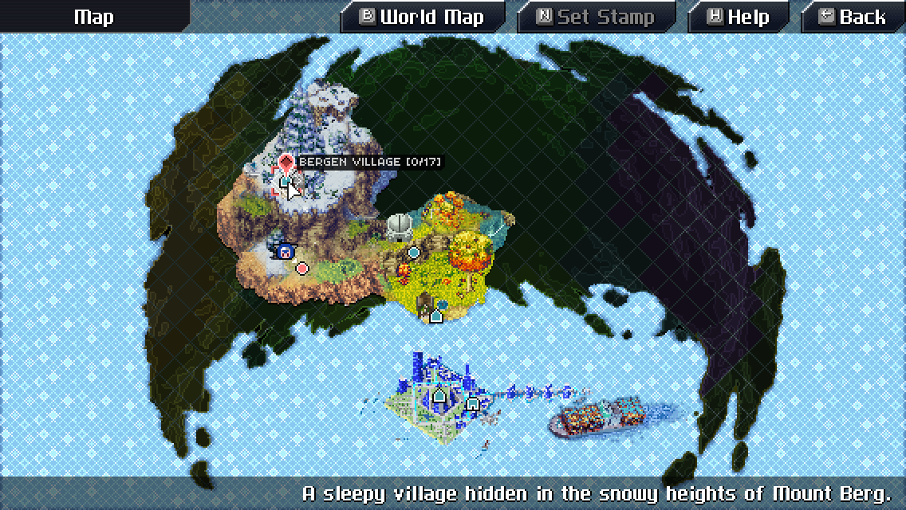

# cc-world-map-overhaul

A better world map for CrossCode.

This mod hides unvisited areas to avoid in-game spoilers. It also changes the area buttons in the world map menu to increase contrast when selecting areas.

## Authors

**Packy** came up with the concept and drew the map (see file `assets/media/gui/better-world-map/final.psd`). Note that this map is comprised of downscaled sprites from CrossCode, so credits for them goes to RadicalFishGames.

**dmitmel** wrote the source code, drew some GUI sprites (which are based on some sprites from CrossCode) and cut out separate areas from the map file.

## License

Code is licensed under the [MIT license](https://spdx.org/licenses/MIT.html).

Media assets (sprites and other images) are licensed under the [Creative Commons Attribution 4.0 International license](https://creativecommons.org/licenses/by/4.0/).
